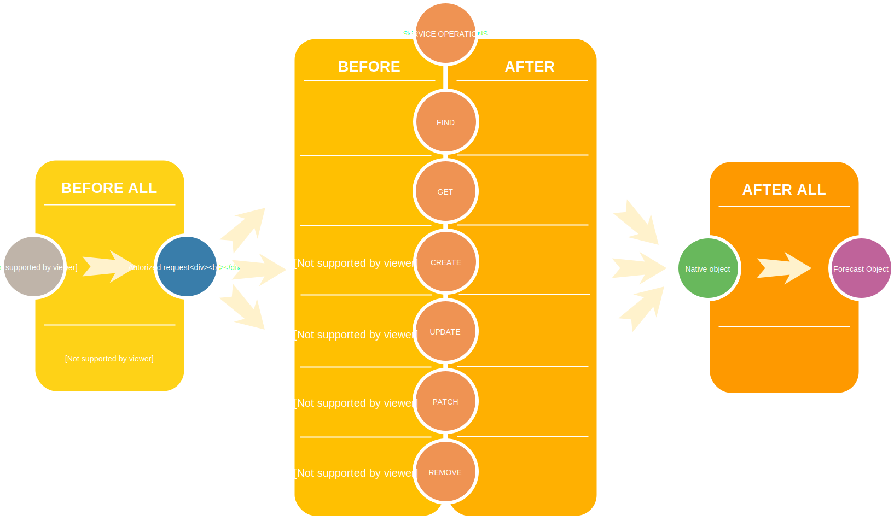

# Forecast model

::: tip
On the client/server side the API is exposed using the [Feathers isomorphic API](https://docs.feathersjs.com/api/client.html#universal-isomorphic-api) and the [Feathers common database query API](https://docs.feathersjs.com/api/databases/querying.html)
:::

**Weacast** exposes the available forecast model instances found in the [configuration](../guides/basics.md#configuring) at startup through the `forecasts` service, as a consequence the configuration file exposes the data model. Although only web sockets are usually used on the client side, both the [REST](https://docs.feathersjs.com/api/rest.html) and the [Socket](https://docs.feathersjs.com/api/socketio.html) interfaces are configured.

For example you can request the available forecasts like this:
```javascript
import app from 'src/api'

app.getService('forecasts').find()
.then(response => {
  response.data.forEach(forecast => {
    // Do something with the current forecast model
  })
})
```

> `create`, `update`, `patch`, `remove` methods are only allowed from the server side, clients can only `get`and `find` forecasts

## Data model

The common data model of a forecast model instance as used by the API is [detailed here](../architecture/data-model-view.md#forecast-data-model).

## Forecast model hooks

The following [hooks](./hooks.md) are executed on the Forecast model service:

