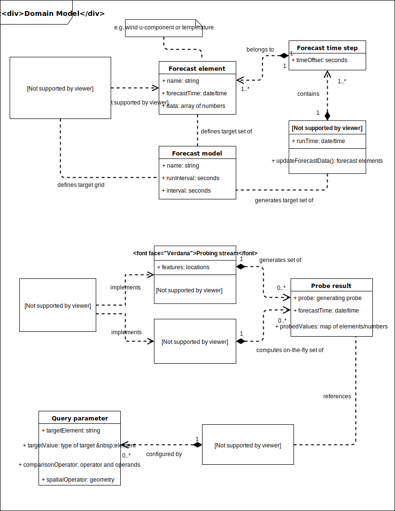

# Domain model

The **domain model** is a set of high-level abstractions that describes selected aspects of a sphere of activity, more specifically [numerical weather prediction](https://en.wikipedia.org/wiki/Numerical_weather_prediction) for Weacast. It is a representation of meaningful real-world concepts pertinent to the domain that are modeled in the software. The concepts include the data involved in the business and rules the business uses in relation to that data.

The class diagram used to represent the domain model in the [Unified Modeling Language](https://en.wikipedia.org/wiki/Unified_Modeling_Language) (UML) is presented afterwards. The Weacast domain model is implemented as a hybridation between [objects](https://en.wikipedia.org/wiki/Object-oriented_programming) and [cross-cutting concerns](https://en.wikipedia.org/wiki/Aspect-oriented_software_development) within a layer that uses a lower-level layer for [persistence](./data-model-view.md) and *publishes* an [API](./../api/README.md) to a higher-level layer to gain access to the data and behavior of the model. 

To get into the details of this model look at the [persisted data model](./data-model-view.md) and the provided [API](./../api/README.md).
