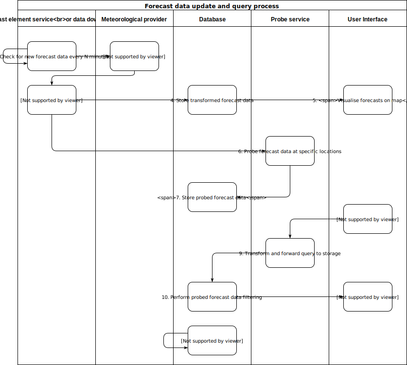

# Dynamic view of the architecture

The typical sequence of events that follow on from one component/interface of the architecture to another and the main data flows between components/interfaces of Weacast are summarized in the following diagram.

