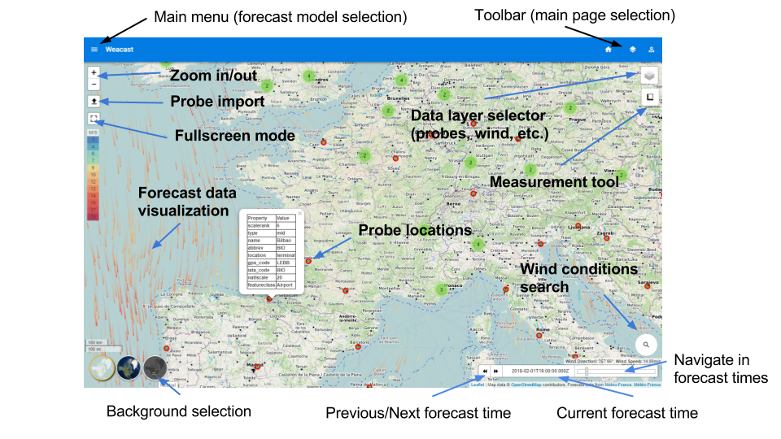
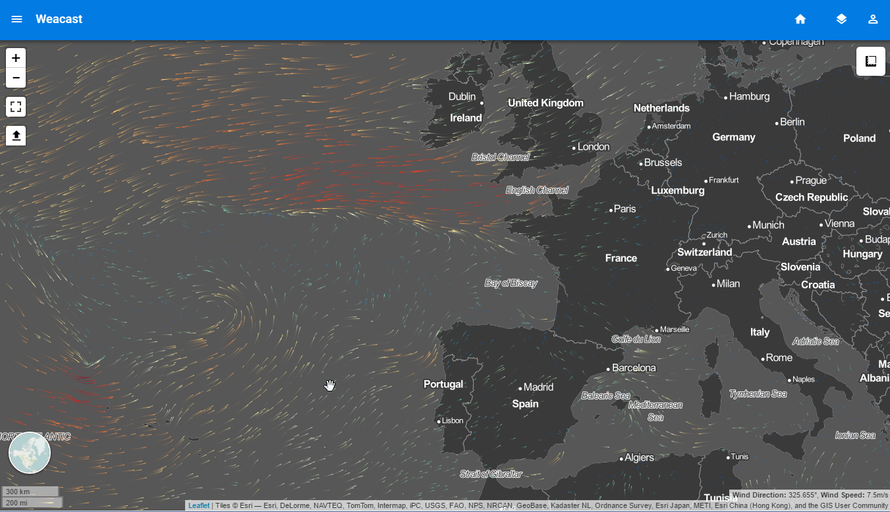
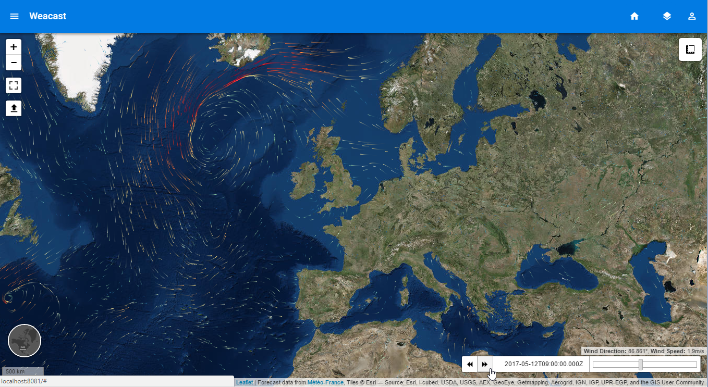
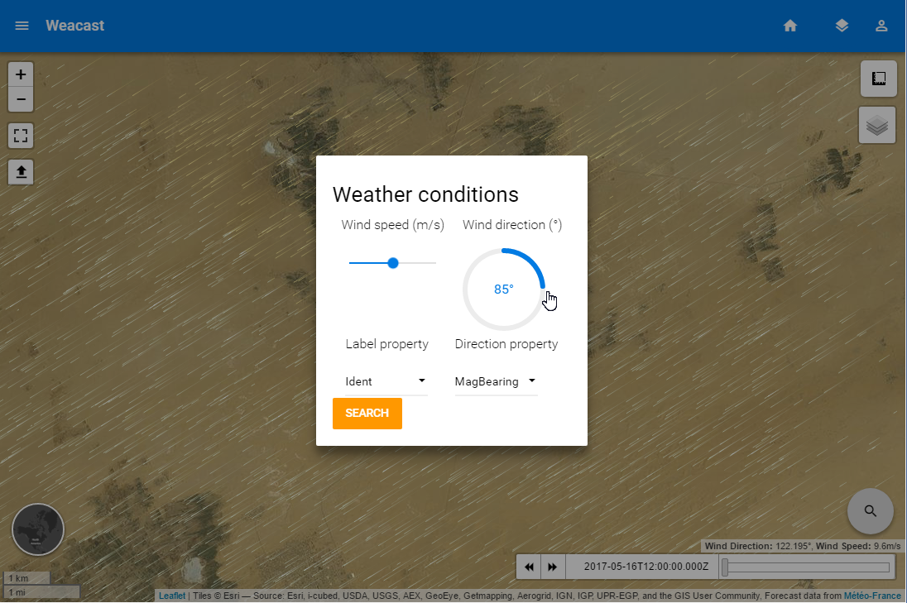
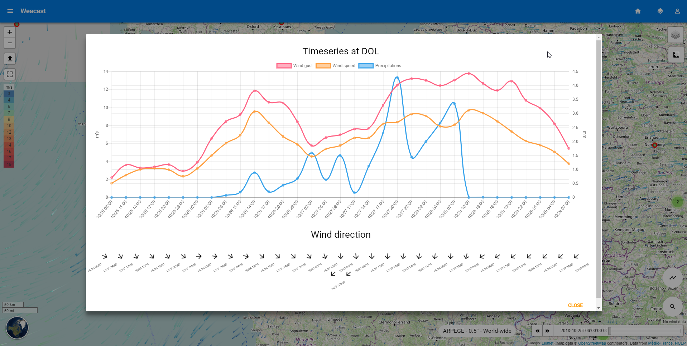
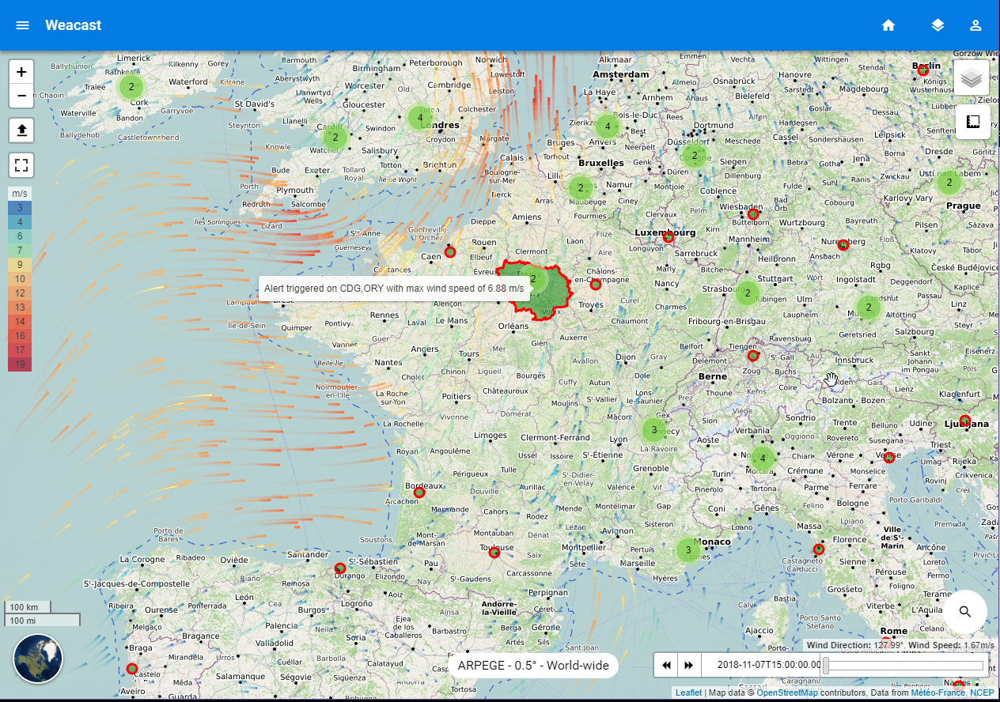

# Showcase

## Demo application

You can find the source code of our web application demo in the [weacast](https://github.com/weacast/weacast) repository. It mainly depends on:
* [weacast-api](https://github.com/weacast/weacast-api) module providing the backend API
* [weacast-client](https://github.com/weacast/weacast-client) module providing the frontend objects for mapping

::: warning
[weacast-client](https://github.com/weacast/weacast-client) module will not evolve anymore (see discussion [here](https://github.com/weacast/weacast-client/issues/6)) and will only be maintained for the purpose of our [demo application](https://github.com/weacast/weacast). If you'd like to build client applications using Weacast you'd better use the client API layer in the [core module](https://github.com/weacast/weacast-core) and dedicated map engine modules like our [Leaflet plugin](https://github.com/weacast/weacast-leaflet).
:::

On our demo weather data is gathered from the GFS (NCEP) and ARPEGE (Météo France) forecast models. The map shows:
* wind u/v-components (i.e. speed and direction) using a [flow layer](../api/layers.md#flowlayer-source)
* wind gust (i.e. max speed) using a [heat layer](../api/layers.md#heatlayer-source) or a [scalar layer](../api/layers.md#scalarlayer-source)
* precipitations using an additional [scalar layer](../api/layers.md#scalarlayer-source)
* a worldwide set of airports used to [probe](../architecture/main-concepts.md#probe) forecast data at these locations

Using the playback buttons at the bottom of the map you can navigate among available forecast times and see the map change. On the side menu you can select the currently visualized weather forecast model. Last but not least, using the search button on the map you will be able to find the airport matching best specific wind conditions (i.e. speed/direction) based on the probed data. The analysis uses the [same weight](https://github.com/weacast/weacast/blob/master/src/components/WindSeeker.vue#L125) for both speed and direction differences so that it might result in a good match on speed **and/or** direction depending on the weather. You can also probe your own data by importing a GeoJSON file containing a collection of points, each location will be probed for the current forecast time.

You can also obtain a timeseries of forecast elements by either selecting one of the airports or double click on any location on the map. You will then see a timeseries button appear, which allow to open a popup displaying different graphs. Last but not least, you can activate an [alert zone](../architecture/main-concepts.md#alert) in the layer list to raise alerts in Paris whenever the wind speed is greater than 0 (this is of course unrealistic alert conditions to ensure it will always raises for demonstration purpose !).

::: tip
Be sure to also have a look to our list of known [production applications](./ecosystem.md#production-applications).
:::

## Visualize forecast data

This short video demonstrates how Weacast can be used to gather forecast data from different models to visualize and predict wind in different locations.

## Explore forecast data

This short video demonstrates how Weacast can be used to explore forecast data and future wind prediction using a timeline widget.

## Probe forecast data

This short video demonstrates how Weacast can be used to probe your own business data to find locations matching target weather conditions. Using runways data, first are found airports with a target wind direction, then runways with a target wind direction relative to their own orientation.

This short video demonstrates how Weacast can be used to probe your own business data or any location in the world to obtain timeseries of forecast elements.

This image illustrates how Weacast can be used to raise alerts on your probes with respect to weather conditions (temperature, humidity, pressure, etc.) in a specified period of time and area.

