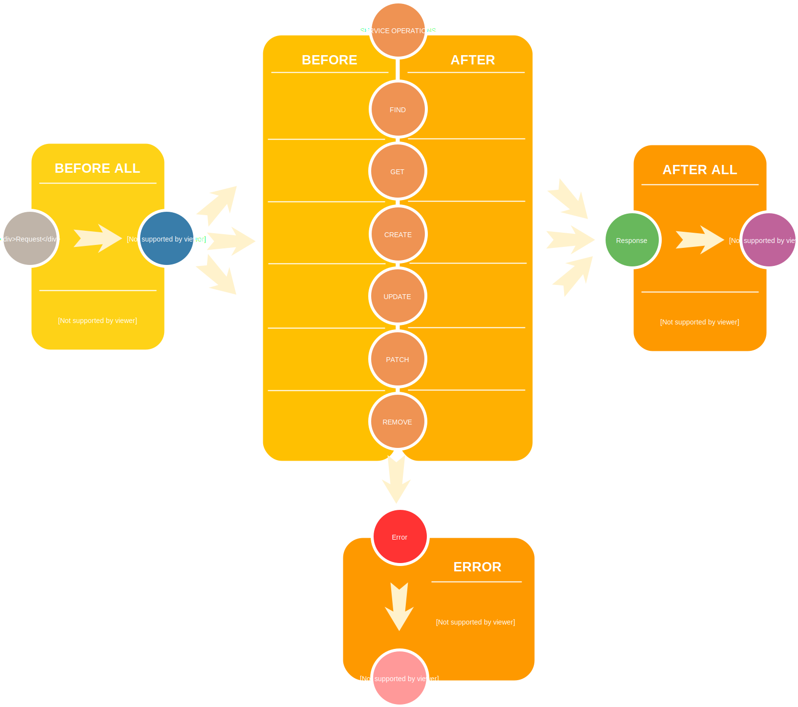

# Application

## Backend setup

Weacast [core module](https://github.com/weacast/weacast-core) provides a helper to quickly initialize what is required for your [server application](https://docs.feathersjs.com/api/application.html). The core module provides the ability to initialize a new Weacast application instance, attach it to the configured database and setup authentication:

```javascript
import { weacast } from 'weacast-core'

// Initialize app
let app = weacast()
// Connect to DB
await app.db.connect()
```

### Authentication

Weacast includes a built-in local authentication strategy based on the [Feathers authentication module](https://docs.feathersjs.com/api/authentication/server.html). It also automatically configures the [Feathers OAuth2 plugin](https://docs.feathersjs.com/api/authentication/oauth2.html) for [GitHub](https://github.com/jaredhanson/passport-github), [Google](https://github.com/jaredhanson/passport-google-oauth2), [OpenID Connect](https://github.com/kalisio/passport-openidconnect) and [Congnito](https://github.com/bainweb/passport-oauth2-cognito) if you provide them in your [configuration file](./../guides/basics.md#configuring).

You can read [this article](https://blog.feathersjs.com/how-to-setup-oauth-flow-with-featherjs-522bdecb10a8) to learn more about the underlying process.

### HTTPS support

Adding the right configuration like below you can easily Weacast run under [HTTPS](https://docs.feathersjs.com/api/express.html#https):
```javascript
https: {
  key: path.join(__dirname, 'server.key'),
  cert: path.join(__dirname, 'server.crt'),
  port: process.env.HTTPS_PORT || 8084
}
```

## Client setup

The Weacast [core module](https://github.com/weacast/weacast-core) or the legacy Weacast [client module](https://github.com/weacast/weacast-client) provides a helper to quickly initialize what is required for your [client application](https://docs.feathersjs.com/api/client.html).

::: warning
Weacast [client module](https://github.com/weacast/weacast-client) will not evolve anymore (see discussion [here](https://github.com/weacast/weacast-client/issues/6)) and will only be maintained for the purpose of our [demo application](https://github.com/weacast/weacast). If you'd like to build client applications using Weacast you'd better use the client API layer in [core module](https://github.com/weacast/weacast-core).
:::

```javascript
import { weacast } from 'weacast-core/client'

// Initialize API wrapper
let api = weacast()
// Retrieve a given service
let probes = api.getService('probes')
```

## Application API

### .getService(name) - backend/client

Retrieve the given service by name, should replace [Feathers service method](https://docs.feathersjs.com/api/application.html#servicepath) so that you are abstracted away from service path (i.e. API prefix) and only refer to it by internal name.

::: tip
On the client side this is also used to instantiate the service on first call.
:::

### .getElementServices(name) - backend only

Retrieve all forecast element services related to a forecast model (or all if not provided) instance by name.

### .createService(name, app, modelsPath, servicesPath) - backend only

Create a new service attached to the application by name and given a set of directories where to find model/service

This assumes you have created a *models* and *services* directories containing the required files to declare your service, e.g. your folder/file hierarchy should look like this:
* *index.js*
* *models* : constains one file per database adapter you'd like to support, e.g.
  * *serviceName.model.mongodb.js* : exporting the data model managed by your service in [MongoDB](https://docs.feathersjs.com/api/databases/mongodb.html)
* *services*
  * *serviceName*
    * *serviceName.hooks.js* : exporting the [hooks](https://docs.feathersjs.com/api/hooks.html) of your service, 
    * *serviceName.filters.js* : exporting the [filters](https://docs.feathersjs.com/api/events.html#event-filtering) of your service, 
    * *serviceName.service.js* : exporting the specific mixin associated to your service (optional)
    
::: warning
Only [MongoDB](https://docs.feathersjs.com/api/databases/mongodb.html) is officially supported right now although we had an experimental attempt with [LevelUP](https://github.com/feathersjs/feathers-levelup) as well. Please contact us if you'd like to support more adapters.
:::
  
### .createElementService(forecast, element, app, servicesPath) - backend only

Internally used by [forecast model plugins](./plugin.md), similar to above but using the built-in forecast element model.

## Application Hooks

The following [hooks](./hooks.md) are globally executed on the application:

