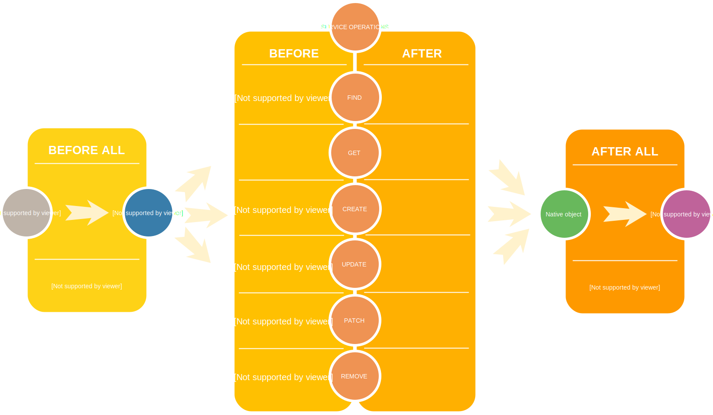

# Forecast element

> On the client/server side the API is exposed using the [Feathers isomorphic API](https://docs.feathersjs.com/api/client.html#universal-isomorphic-api) and the [Feathers common database query API](https://docs.feathersjs.com/api/databases/querying.html)

Forecast model instances expose each element found in [configuration](../guides/basics.mdconfiguring) through a service named `forecast.name/element.name` implementing the [Feathers service interface](https://docs.feathersjs.com/api/services.html) for [CRUD](https://en.wikipedia.org/wiki/Create,_read,_update_and_delete). Although only web sockets are usually used on the client side by default, both the [REST](https://docs.feathersjs.com/api/rest.html) and the [Socket](https://docs.feathersjs.com/api/socketio.html) interfaces are configured.

> `create`, `update`, `patch`, `remove` methods are only allowed from the server side, clients can only `get`and `find` forecast elements.

Each forecast model instance exposes each element service using a database adapter as an implementation of the [Feathers service interface](https://docs.feathersjs.com/api/services.html). Because we want to remain database-agnostic, just like [Feathers is](https://docs.feathersjs.com/guides/step-by-step/intro/not-worry.html#how-do-i-use-my-preferred-database), the database adapter to be used is only known at startup depending on your [configuration](../guides/basics.mdconfiguring). That's the reason why there is no static forecast element class in the core of Weacast, instead it provides a set of [functional mixins](https://github.com/daffl/uberproto#mixins) that will be applied on the instantiated element service and are described hereafter. 

## Data model

The common data model of a forecast element as used by the API is [detailed here](../architecture/data-model-view.md#element-data-model).

> Forecast element data are usually large so they are not returned by default, , you have to explicitely ask for using [`$select`](https://docs.feathersjs.com/api/databases/querying.html#select)

## Available forecast data

For example you can request the available forecast data for a given element like this:
```javascript
import api from 'src/api'

api.getService(forecast.name + '/' + element.name).find()
.then(response => {
  // Do something with the element data
})
```
Response:
```json
{
  "total": 27,
  "limit": 10,
  "skip": 0,
  "data": [
    {
      "_id": "59144a3ed0c0a234f8b4f86d",
      "runTime": "2017-05-11T06:00:00.000Z",
      "forecastTime": "2017-05-11T19:00:00.000Z",
      "minValue": -10.490379333496094,
      "maxValue": 15.306495666503906
    },
    {
      "_id": "59144ab0d0c0a234f8b4f88b",
      "runTime": "2017-05-11T06:00:00.000Z",
      "forecastTime": "2017-05-12T00:00:00.000Z",
      "minValue": -10.069664001464844,
      "maxValue": 11.477210998535156
    }
  ]
}
```

## Property selection

You can skip pagination and retrieve selected properties only:
```javascript
import api from 'src/api'

api.getService(forecast.name + '/' + element.name).find({
  query: {
    $paginate: false,
    $select: ['forecastTime']
  }
})
.then(response => {
  // Do something with the element data
})
```
Response:
```json
[
  {
    "_id": "59144a3ed0c0a234f8b4f86d",
    "forecastTime": "2017-05-11T19:00:00.000Z"
  },
  {
    "_id": "59144a83d0c0a234f8b4f881",
    "forecastTime": "2017-05-11T22:00:00.000Z"
  },
  {
    "_id": "59144a95d0c0a234f8b4f886",
    "forecastTime": "2017-05-11T23:00:00.000Z"
  }
 ]
 ```
 
## Data retrieval

To retrieve data for a given time you have to request it explicitly:

```javascript
import api from 'src/api'

api.getService(forecast.name + '/' + element.name).find({
  query: {
    time: new Date().toISOString(),
    $select: ['forecastTime', 'data']
  }
})
.then(response => {
  // Do something with the element data
})
```
Response:
```json
{
  "total": 1,
  "limit": 10,
  "skip": 0,
  "data": [
    {
      "_id": "59144a3ed0c0a234f8b4f86d",
      "forecastTime": "2017-05-11T19:00:00.000Z",
      "data": [ ... ]
     }
   ]
 }
 ```

When no more query parameters are provided the data retrieved are the ones at the original resolution of the model. If you want to resample data at a lower resolution to improve bandwidth and performance you could add the target grid configuration as parameters:

```javascript
import api from 'src/api'

api.getService(forecast.name + '/' + element.name).find({
  query: {
    time: new Date().toISOString(),
    $select: ['forecastTime', 'data'],
    oLon: origin[0],
    oLat: origin[1],
    sLon: size[0],
    sLat: size[1],
    dLon: resolution[0],
    dLat: resolution[1],
  }
})
.then(response => {
  // Do something with the element data
})
```
where:
* **origin** is the geographical origin of the target data grid as an array of decimal values `[longitude origin, latitude origin]`,
  * **size** is the size of the target data grid as an array of integer values `[width, height]`,
  * **resolution** is the geographical resolution of the target data grid as an array of decimal values `[longitude resolution, latitude resolution]`
  
## Tiles

When [tiling](https://github.com/perliedman/tiled-maps) is enabled you can retrieve element tiles instead of the whole forecast data when you'd like to know what occurs in a given area or at a given location. Because tiles have an indexed geometry property you can perform a [geospatial query](https://docs.mongodb.com/manual/reference/operator/query-geospatial/).

If you also configured your element services to generate tiles with aggregated data over all forecast times you can select it by querying with the following additional field: `{ timeseries: true }`.

## Base element mixin

[source](https://github.com/weacast/weacast-core/blob/master/src/mixins/mixin.element.js)

This mixin includes the most basic functions shared by all forecast elements

### .getNearestRunTime(datetime)

Returns the nearest weather prediction model run date/time for a given date/time, it basically rounds the hours according to the `runInterval ` value in the [model configuration](../guides/basics.mdbackend-side).

### .getNearestForecastTime(datetime)

Returns the nearest weather prediction model forecast date/time step for a given date/time, it basically rounds the hours according to the `interval ` value in the [model configuration](../guides/basics.mdbackend-side).

## Refresh element mixin

[source](https://github.com/weacast/weacast-core/blob/master/src/mixins/mixin.element.js)

This mixin includes the most basic functions shared by all forecast elements to help updating forecast data from providers.

### .getDataDirectory()

Returns the path where downloaded/persisted data are located for the element

### async .updateForecastData(mode)

Launches the forecast data update process for the element depending on the mode value:
* **`'once'`** : will perform data update for the current time only
* **`'interval'`** : will perform data update for the current time and schedule the update process at regular interval after each data gathering according to the `updateInterval ` value in the [model configuration](../guides/basics.mdbackend-side).

###  async .refreshForecastData(datetime)

Refreshes forecast data for the element based on the nearest run for the provided date/time. It will harvest data for each forecast time step available in the model according to the `lowerLimit`/`upperLimit` values in the [model configuration](../guides/basics.mdbackend-side).

###  async .harvestForecastTime(datetime, runTime, forecastTime)

Refreshes forecast data for the element based on the provided run and forecast date/time. If the run is not yet available through the provider it will try to use the previous one until the `oldestRunInterval` value in the [model configuration](../guides/basics.mdbackend-side) is reached.

### async .refreshForecastTime(datetime, runTime, forecastTime)

Download the forecast data for the given run/forecast date/time and process it, i.e. convert it if required then store it in the database.

### async .downloadForecastTime(runTime, forecastTime)

Download the forecast data for the given run/forecast date/time and returns the file path to the downloaded data.

## Forecast element hooks

The following [hooks](./hooks.md) are executed on each Forecast element service:

